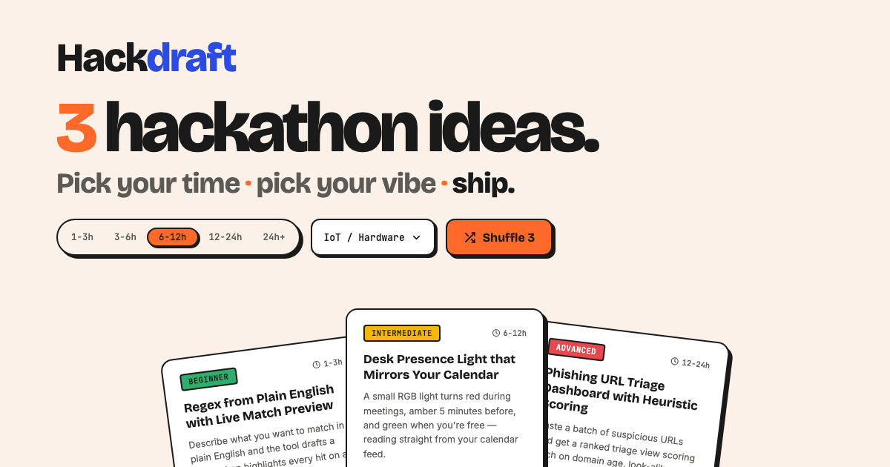

# HackDraft



Get **3 curated hackathon project ideas** in one click. Filter by how much time you have and what you feel like building — shuffle until something clicks, then go ship it.

## What it does

- **3 ideas on demand** — a curated pool of hackathon projects, randomised on every shuffle
- **Time filter** — 5 slots from 1-3h to 24h+ so ideas match your actual availability
- **Topic filter** — 10 categories (AI/ML, IoT, Cybersecurity, Games, Web3, and more)
- **Live filtering** — slider and dropdown update the card set instantly, no page reload
- **Bilingual** — full EN / ES toggle, including all card content
- **Single screen** — everything above the fold on desktop, stacked on mobile

## Stack

| Layer | Tech |
|---|---|
| Framework | Next.js 16 (App Router) |
| Language | TypeScript 5 |
| Styles | Tailwind CSS v4 (CSS-first config) |
| Fonts | Bricolage Grotesque · Inter · JetBrains Mono |
| Deployment | Cloudflare Workers (via `wrangler`) |

## Running locally

```bash
npm install
npm run dev
```

Open [http://localhost:3000](http://localhost:3000).

## Deploying

```bash
npm run deploy
```

Targets Cloudflare Workers. Set `NEXT_PUBLIC_SITE_URL` to your domain so OG image URLs resolve correctly.
